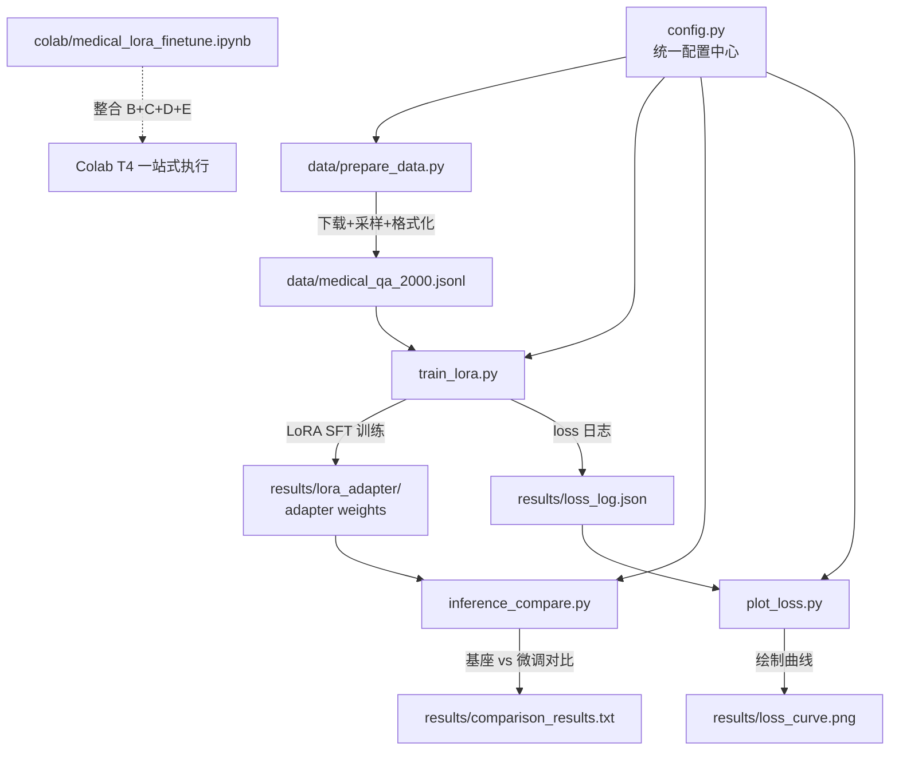

## 产品概述

一个轻量级医疗大模型 LoRA 指令微调实践项目，用最短时间（2小时内）跑通完整流程：数据准备 -> LoRA 微调 -> 推理对比 -> 成果展示。项目同时提供本地 Python 脚本和 Colab 一站式笔记本两种交付形式，适配用户本地 8GB 以下显存 GPU 和 Colab T4 两种环境。

## 核心功能

- **数据准备**：从 HuggingFace 下载 `shibing624/medical` 的 `finetune/train_zh_0.json`（纯中文子集，约 194 万条），随机抽样约 2000 条，转换为 Qwen ChatML 指令格式。字段处理：`input` 非空时拼成 `{instruction}\n{input}` 作为 user 内容，为空时只用 `instruction`
- **LoRA 微调训练**：基于 Qwen1.5-0.5B 基座模型，用 LoRA（r=8, target_modules=q_proj/v_proj）进行指令微调，打印可训练参数量验证"参数骤减"效果，全程记录 loss
- **推理对比验证**：对 5 个典型医学问题，分别用基座模型和微调后模型生成回答，输出并排对比，展示微调带来的专业性提升
- **Loss 曲线可视化**：从训练日志中提取 loss 数据，绘制并保存训练损失曲线图
- **Colab 一站式笔记本**：将上述全流程整合为单个 .ipynb 笔记本，在 Colab T4 上开箱即用
- **面试表述素材**：README 中包含 LoRA 原理简述、完整复现指引和一句话总结

## 技术栈

- **语言**：Python 3.10+
- **深度学习框架**：PyTorch 2.2.1
- **模型库**：Transformers 4.39.3（加载 Qwen1.5-0.5B 基座模型、Tokenizer、Trainer 训练框架）
- **参数高效微调**：PEFT 0.9.0（LoraConfig + get_peft_model + PeftModel 推理加载）
- **数据集处理**：Datasets 2.18.0（load_dataset 下载/缓存/采样）
- **训练加速**：Accelerate 0.27.2（Trainer 底层依赖，管理设备分配）
- **可视化**：Matplotlib 3.8.4（绘制 loss 曲线）
- **交付格式**：本地 `.py` 脚本 + Colab `.ipynb` 笔记本

## 实现方案

### 总体策略

采用 HuggingFace 生态标准三件套（Transformers + PEFT + Datasets）构建完整的 LoRA SFT 流程。核心思路是：冻结 Qwen1.5-0.5B 全部预训练权重，仅在 `q_proj` 和 `v_proj` 两个注意力投影层上注入低秩适配器（r=8），使得可训练参数仅为原模型的极小部分，在 8GB 以下显存 GPU 上即可完成训练。

### 关键技术决策

**1. 显存优化策略（<8GB VRAM 核心约束）**

- **FP16 半精度加载**：`torch_dtype=torch.float16`，模型权重从 ~2GB 降至 ~1GB
- **Gradient Checkpointing**：`gradient_checkpointing=True`，以约 20% 额外计算时间换取大幅激活内存节省
- **小 batch + 梯度累积**：`per_device_train_batch_size=1` + `gradient_accumulation_steps=8`，等效 batch_size=8 但每次仅 1 条数据在显存中
- **序列长度限制**：`max_seq_len=512`，控制单条数据的 token 数上限
- **OOM 降级提示**：训练脚本检测 CUDA OOM 后打印清晰降级建议（减小 max_seq_len / 换用 Colab T4 / 尝试 QLoRA 4-bit 量化）
- 预估峰值显存：0.5B 模型 FP16 权重 ~1GB + LoRA 参数+优化器状态 ~50MB + 单条激活（gradient checkpointing 后）~1-2GB = **总计约 3-4GB**，8GB 以下 GPU 可覆盖

**2. 数据格式与 Prompt 模板**
使用 Qwen1.5 原生 ChatML 格式构建训练样本。数据来源为 `shibing624/medical` 的 `finetune/train_zh_0.json`（纯中文），字段 `instruction` + `input` + `output` 三段式，其中 `input` 可为空：

```
<|im_start|>system
你是一个专业的医疗助手。<|im_end|>
<|im_start|>user
{user_content}<|im_end|>
<|im_start|>assistant
{output}<|im_end|>
```

其中 `{user_content}` 的构造规则：
- `input` 非空时：`{instruction}\n{input}`（保留病人描述信息）
- `input` 为空时：直接用 `{instruction}`

训练时对 prompt 部分（system + user）的 token 进行 label masking（设为 -100），仅在 assistant 回答部分计算 loss，确保模型学习"如何回答"而非"记忆问题"。

**3. 可训练参数量验证**
调用 `model.print_trainable_parameters()` 打印 PEFT 内置统计，同时在脚本中额外计算可训练参数占总参数的百分比，输出格式示例：

```
可训练参数: 688,128
总参数: 494,032,896
可训练占比: 0.14%
```

此数据直接验证 LoRA "参数量骤减约 256 倍"的原理。

**4. Loss 记录与可视化**
自定义 `TrainerCallback` 子类，在每个 logging step 将 `{step, loss}` 写入 `results/loss_log.json`。训练结束后由 `plot_loss.py` 读取 JSON 绘制曲线图，保存为 `results/loss_curve.png`。无需安装 TensorBoard，降低依赖复杂度。

**5. 推理对比设计**
预置 5 个典型医学问题（感冒处理、高血压饮食、糖尿病症状、儿童发烧处理、长期失眠调理），对每个问题分别用以下两种方式生成回答：

- 基座模型直接推理（`model.generate`）
- `PeftModel.from_pretrained(base_model, adapter_path)` 加载 LoRA adapter 后推理
对比结果以结构化文本输出到 `results/comparison_results.txt`，同时控制台打印。

### 性能与可靠性

- **训练耗时**：2000 条数据 x 3 epochs x 0.5B 模型，T4 上约 30-40 分钟，本地 8GB GPU 约 40-60 分钟
- **数据缓存**：`load_dataset` 自动缓存下载结果，重复运行不重复下载
- **检查点保存**：每个 epoch 保存 adapter 权重，训练中断可从最近 checkpoint 恢复
- **确定性**：设置 `seed=42`，确保数据采样和初始化可复现

## 架构设计



## 目录结构

```
MedicalChatGPT/
├── README.md                          # [NEW] 项目文档：LoRA 原理简述、复现指引、交付物说明、面试一句话总结
├── requirements.txt                   # [NEW] 锁定版本依赖列表
├── .gitignore                         # [NEW] 忽略 results/、data 缓存、__pycache__、.ipynb_checkpoints
├── config.py                          # [NEW] 统一配置中心：模型名、LoRA 参数、训练超参、数据路径、推理问题列表，所有脚本共享
├── data/
│   └── prepare_data.py                # [NEW] 数据准备脚本：用 load_dataset 下载 shibing624/medical，随机抽样 2000 条，转换为 ChatML 格式 JSONL
├── train_lora.py                      # [NEW] LoRA 训练脚本：FP16 加载基座 + gradient checkpointing + LoraConfig 注入 + Trainer 训练 + 自定义 loss 回调 + 参数量打印
├── inference_compare.py               # [NEW] 推理对比脚本：加载基座模型和 LoRA adapter，对 5 个医学问题生成回答，输出并排对比
├── plot_loss.py                       # [NEW] Loss 可视化脚本：读取 loss_log.json，用 matplotlib 绘制并保存 loss 曲线图
├── colab/
│   └── medical_lora_finetune.ipynb    # [NEW] Colab 一站式笔记本：GPU 检测 -> 安装依赖 -> 数据准备 -> 训练 -> 推理对比 -> loss 绘图，全流程在 T4 上运行
└── results/                           # [NEW] 训练产物目录（运行时生成）
    └── .gitkeep                       # [NEW] 占位文件
```

## 关键代码结构

### config.py — 统一配置

```python
# 基座模型
BASE_MODEL = "Qwen/Qwen1.5-0.5B"
ADAPTER_PATH = "./results/lora_adapter"

# LoRA 配置（与交接文档对齐：r=8, alpha=16, q_proj+v_proj）
LORA_R = 8
LORA_ALPHA = 16
LORA_DROPOUT = 0.05
LORA_TARGET_MODULES = ["q_proj", "v_proj"]

# 训练超参（显存友好：batch=1 + 梯度累积=8）
MAX_SEQ_LEN = 512
BATCH_SIZE = 1
GRAD_ACCUM_STEPS = 8
LEARNING_RATE = 2e-4
NUM_EPOCHS = 3
WARMUP_RATIO = 0.03
SEED = 42

# 数据
DATASET_NAME = "shibing624/medical"
DATASET_SPLIT = "finetune/train_zh_0.json"  # 纯中文 SFT 子集
DATA_SAMPLE_SIZE = 2000
PROCESSED_DATA_PATH = "./data/medical_qa_2000.jsonl"

# 推理对比问题
MEDICAL_QUESTIONS = [
    "感冒了应该怎么办？",
    "高血压患者的饮食注意事项有哪些？",
    "什么是糖尿病？有哪些常见症状？",
    "儿童发烧38.5度需要怎么处理？",
    "长期失眠应该怎么调理？",
]
```

### Loss 回调接口

```python
class LossLoggerCallback(TrainerCallback):
    """训练 loss 记录回调，将每个 step 的 loss 写入 JSON 文件。"""
    def __init__(self, log_path: str): ...
    def on_log(self, args, state, control, logs=None, **kwargs): ...
    # 输出格式: [{"step": 10, "loss": 2.34}, {"step": 20, "loss": 1.87}, ...]
```

## Agent Extensions

### SubAgent

- **code-explorer**
- Purpose: 在实现阶段用于快速检索已生成文件之间的引用关系，确保 config.py 中的常量在各脚本中被正确导入和使用，避免路径/命名不一致问题
- Expected outcome: 确认所有脚本对 config.py 的引用一致、results/ 路径在训练和推理脚本间对齐、Colab 笔记本与本地脚本逻辑无分歧