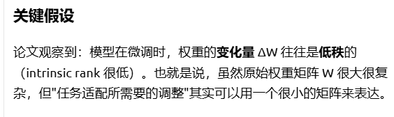
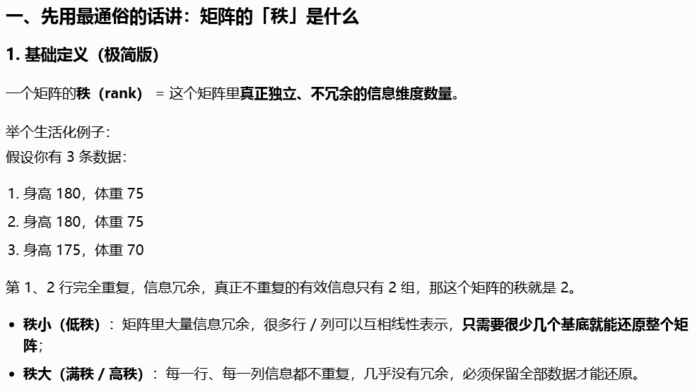
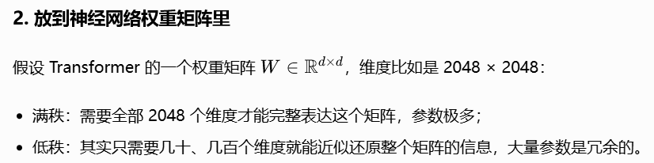
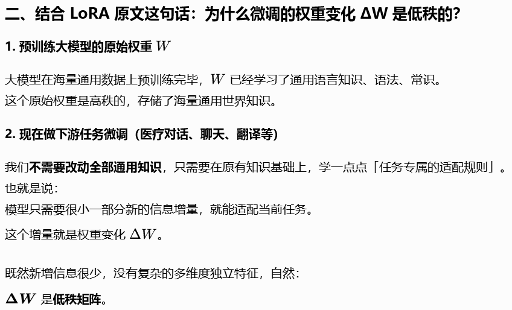
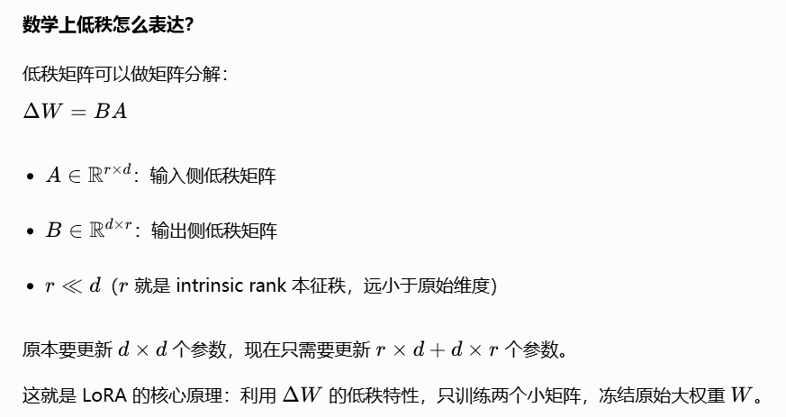

# 医疗大模型 LoRA 指令微调实践

> 用 Qwen1.5-0.5B 作为基座，用 MedicalGPT 项目整理的医学问答数据集（约 2000 条），通过 LoRA 方式微调，可训练参数只有原模型的极小部分。在免费 GPU 上 30-40 分钟训练完成，微调后模型回答更专业、更结构化。

## 项目简介

本项目是一个轻量级医疗大模型指令微调（LoRA）实践，目标是**用最短时间跑通完整流程**，并能清晰讲出每一步做了什么、为什么这么做。

- **基座模型**：Qwen/Qwen1.5-0.5B
- **微调方式**：LoRA（r=8, target_modules=q_proj/v_proj）
- **数据集**：`shibing624/medical` 的 `finetune/train_zh_0.json`（纯中文，抽样 2000 条）
- **训练环境**：本地 GPU（8GB 以下）+ Google Colab T4

---

## LoRA 原理简述






LoRA（Low-Rank Adaptation）是一种参数高效微调方法。核心思想：

```
h = W₀·x + ΔW·x
```

- `x`：输入向量（hidden state），上一层传下来的激活值
- `W₀`：预训练权重矩阵，微调时**冻结不训练**
- `ΔW`：增量权重，微调时**只训练这部分**，代表"领域修正量"

**关键 trick**：`ΔW = A·B`，用两个低秩矩阵近似原本的增量矩阵。

以 Qwen1.5-0.5B 的注意力层为例（维度 1024）：
- 原始增量矩阵：`[1024, 1024]` = 1,048,576 个参数
- LoRA 分解：`[1024, 8] · [8, 1024]` = 16,384 个参数
- 参数量减少约 **64 倍**（r=8 时）

本项目仅在 `q_proj` 和 `v_proj` 两个投影层注入 LoRA，可训练参数约占总参数的 **0.14%**。

---

## 项目结构

```
MedicalChatGPT/
├── README.md                          # 项目文档
├── requirements.txt                   # 锁定版本依赖
├── config.py                          # 统一配置中心
├── data/
│   └── prepare_data.py                # 数据准备：下载 + 抽样 + ChatML 格式转换
├── train_lora.py                      # LoRA 训练脚本
├── inference_compare.py               # 推理对比：基座 vs 微调后
├── plot_loss.py                       # Loss 曲线绘制
├── colab/
│   └── medical_lora_finetune.ipynb    # Colab 一站式笔记本
└── results/                           # 训练产物（运行时生成）
```

---

## 快速开始

### 方式一：Google Colab（推荐，开箱即用）

1. 上传 `colab/medical_lora_finetune.ipynb` 到 [Google Colab](https://colab.research.google.com/)
2. 选择运行时：`运行时 -> 更改运行时类型 -> T4 GPU`
3. 从上到下依次运行单元格
4. 全流程约 30-40 分钟完成

### 方式二：本地运行

**环境要求**：Python 3.10+，CUDA 兼容 GPU（8GB 以下显存即可）

```bash
# 1. 安装依赖
pip install -r requirements.txt

# 2. 准备数据（下载 + 抽样 2000 条 + 格式转换）
python data/prepare_data.py

# 3. LoRA 微调训练（约 40-60 分钟）
python train_lora.py

# 4. 绘制 loss 曲线
python plot_loss.py

# 5. 推理对比（基座 vs 微调后）
python inference_compare.py
```

---

## 交付物说明

| 交付物 | 路径 | 说明 |
|--------|------|------|
| 数据准备脚本 | `data/prepare_data.py` | 下载 `shibing624/medical`，抽样 2000 条，转 ChatML 格式 |
| 训练脚本 | `train_lora.py` | FP16 + LoRA + gradient checkpointing，打印可训练参数量 |
| Loss 曲线 | `results/loss_curve.png` | 训练损失可视化 |
| 推理对比 | `results/comparison_results.txt` | 5 个医学问题，基座 vs 微调后回答对比 |
| Colab 笔记本 | `colab/medical_lora_finetune.ipynb` | 一站式全流程，T4 可直接运行 |

---

## 关键技术点

### 数据格式（ChatML）

使用 Qwen1.5 原生 ChatML 格式，字段处理规则：
- `input` 非空时：`{instruction}\n{input}` 作为 user 内容（保留病人描述）
- `input` 为空时：直接用 `instruction`

```
<|im_start|>system
你是一个专业的医疗助手。<|im_end|>
<|im_start|>user
{user_content}<|im_end|>
<|im_start|>assistant
{output}<|im_end|>
```

训练时对 prompt 部分（system + user）做 label masking（设为 -100），仅在 assistant 回答部分计算 loss。

### 显存优化（8GB 以下 GPU）

| 策略 | 配置 | 效果 |
|------|------|------|
| FP16 半精度 | `torch_dtype=torch.float16` | 模型权重 ~2GB → ~1GB |
| Gradient Checkpointing | `gradient_checkpointing=True` | 牺牲约 20% 计算时间，大幅减少激活内存 |
| 小 batch + 梯度累积 | `batch=1, accum=8` | 等效 batch=8，但每次仅 1 条在显存 |
| 序列长度限制 | `max_seq_len=512` | 控制单条 token 数上限 |

预估峰值显存约 3-4GB，8GB 以下 GPU 可覆盖。

### 可训练参数量验证

训练脚本会打印：

```
可训练参数: 688,128
总参数:     494,032,896
可训练占比: 0.14%
压缩倍数:   718x
```

此数据直接验证 LoRA "只训练极少参数"的原理。

---

## 面试表述素材

> 我实践过医疗大模型的指令微调。用 Qwen-0.5B 作为基座，用 MedicalGPT 项目整理的医学问答数据集（约 2000 条），通过 LoRA 方式微调，可训练参数只有原模型的一小部分（约 0.14%）。在免费 GPU 上 30-40 分钟训练完成，微调后模型回答更专业、更结构化，我验证了几个具体案例。整个过程我理解了 LoRA 的原理（冻结原权重、只训练低秩增量矩阵 ΔW = A·B），也认识到医疗数据质量的重要性。

**可能被追问的问题及回答要点**：

1. **为什么用 LoRA 而不是全量微调？**
   - 全量微调需要训练所有参数，显存需求大、容易过拟合
   - LoRA 只训练低秩增量矩阵，参数量减少数百倍，效果接近全量微调

2. **label masking 是什么意思？**
   - 对 prompt 部分的 token 将 label 设为 -100，训练时不计算 loss
   - 模型只在 assistant 回答部分计算 loss，学习"如何回答"而非"记忆问题"

3. **r=8 是什么意思？**
   - r 是 LoRA 的秩，决定低秩矩阵 A·B 的中间维度
   - r 越大表达能力越强但参数越多，r=8 是常用的小值配置

4. **为什么选 Qwen1.5-0.5B？**
   - 0.5B 参数量小，显存友好，Colab 免费 T4 即可跑
   - 适合实践跑通流程，不追求效果最优
